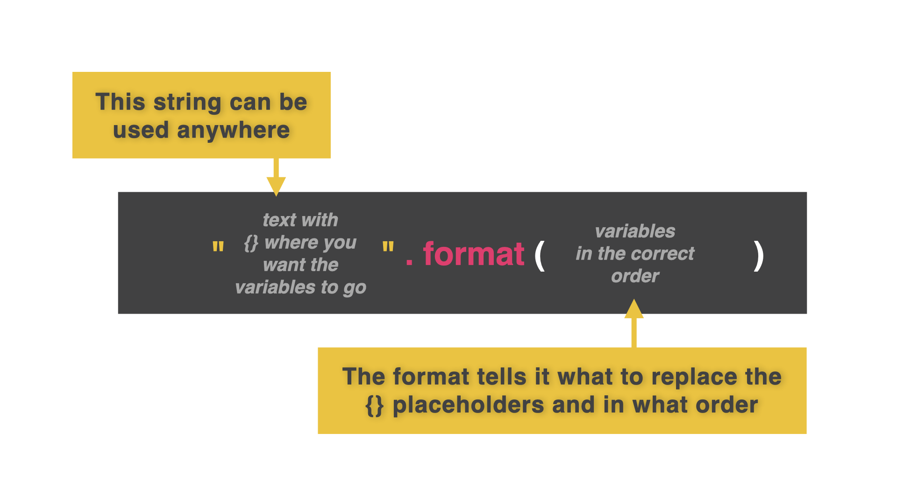

# f-strings

f-strings (format strings) are the best way to combine variables and text together. Everything up until now has been...well...awkward.

👉 Let's look at how we have combined variables and text in the past...concatenating.

```python
name = "Katie"
age = "28"
pronouns = "she/her"

print("This is", name, "using", pronouns, "pronouns and is age", age)
```

##

👉 Let's now use an f-string for this same code. What changes did I make to this code?

```python
name = "Katie"
age = "28"
pronouns = "she/her"

print("This is {}, using {} pronouns, and is {} years old.".format(name, pronouns, age))
```
**Change 1:** Using `{}` as a placeholder for the variable.
**Change 2:** Adding `.format(variable names, commas)`




### Why is this easier? Let's find out.