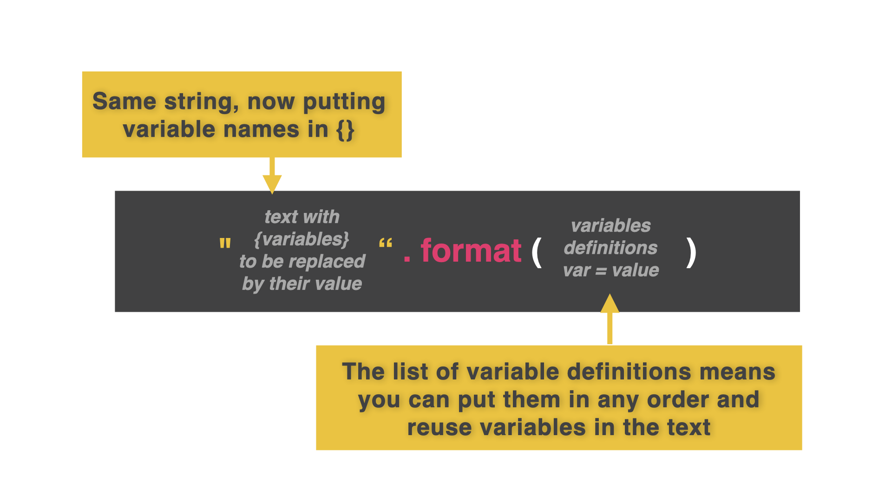

# Local Variables

We can set local variables within the f-string itself. Now it doesn't matter the order of the variables. 

👉 Looking at this code again, I can set my variables *inside*  the text itself. Watch this: 

```python
name = "Katie"
age = "28"
pronouns = "she/her"

print("This is {name}, using {pronouns} pronouns, and is {age} years old. Hello, {name}. How are you? Have you been having a great {age} years so far".format(name=name, pronouns=pronouns, age=age))
```
**Change 1:** Replace `{}`with variable names.
**Change 2:** Replace each variable inside `{}` with what has been defined in `format.( = )`





f-strings work with different variable types too: `int`, `float`, and `string`.

👉 We can assign concatenated sentences to variables. Watch this. We made a variable called response and made it equal to a concatenated sentence. Now I can use this response easily wherever I want.

```python
name = "Katie"
age = "28"
pronouns = "she/her"

response = "This is {name}, using {pronouns} pronouns, and is {age} years old. Hello, {name}. How are you? Have you been having a great {age} years so far".format(name=name, pronouns=pronouns, age=age)

print(response)
```

### Now we have a unique text string. We can't do this with commas.

