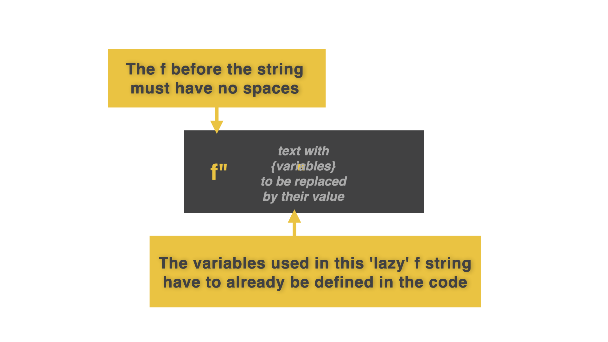

# The Power of f...

Instead of all that faffing about...try this instead. 

Use the letter `f` before any string with `{}` for variable names (and forget that `.format` business).



👉 Look at this same code and see the difference using this technique:

```python
name = "Katie"
age = "28"
pronouns = "she/her"

response = f"This is {name}, using {pronouns} pronouns, and is {age} years old. Hello, {name}. How are you? Have you been having a great {age} years so far"

print(response)
```

### You can even use this trick with the `"""` triple quote. (Remember, when we learned that on Day 1.)