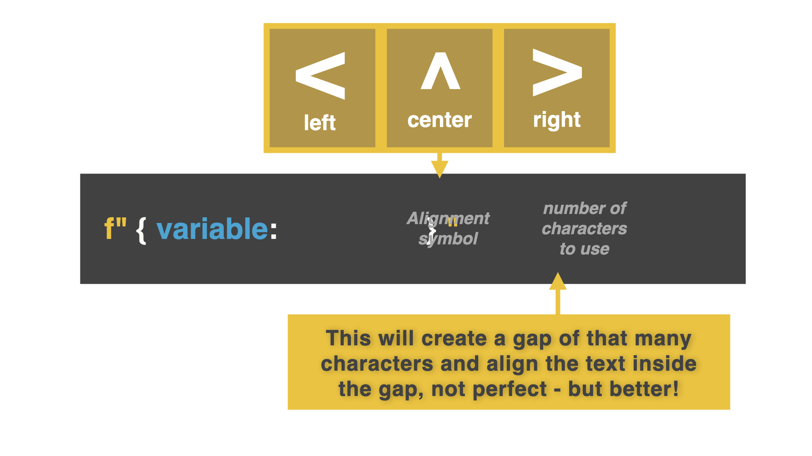

# Alignment





left = `<`, right = `>`, center = `^`

👉 This program shows how much of 100 Days of Code we have completed so far. I want this to look like a list. However, once we get to day 10, it starts to look a bit messy. Make sure you include `f` when using alignment.

```python
for i in range(1, 31):
  print(f"Day {i} of 30")
```

👉 Let's fix it by adding a left alignment of 2 characters long. 


```python
for i in range(1, 31):
  print(f"Day {i: <2} of 30")
```

### Play around with alignment. What do you think?